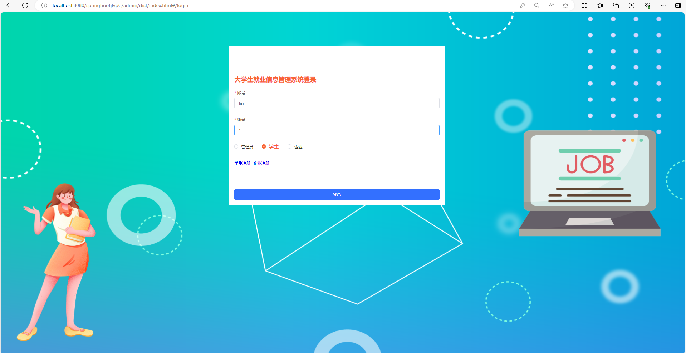
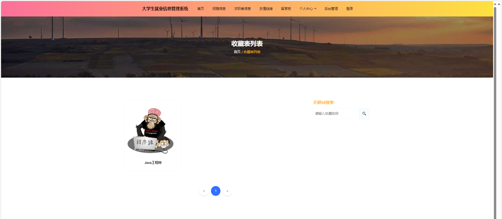
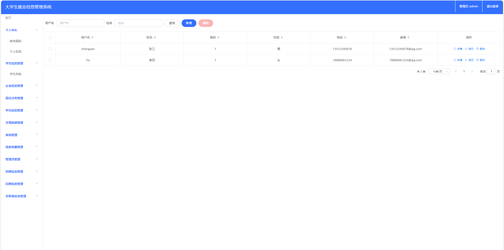
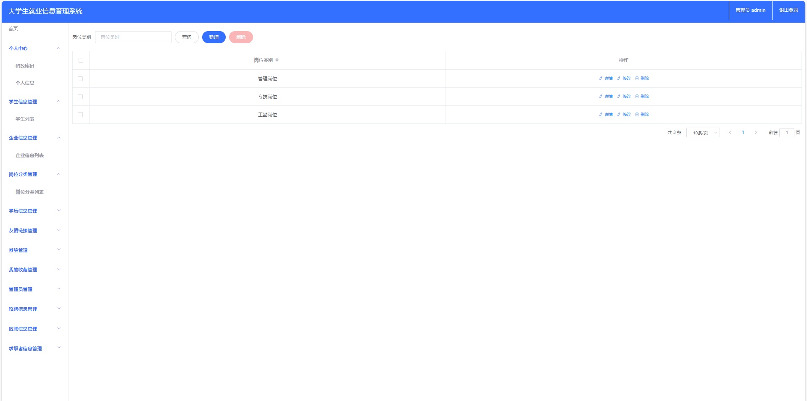
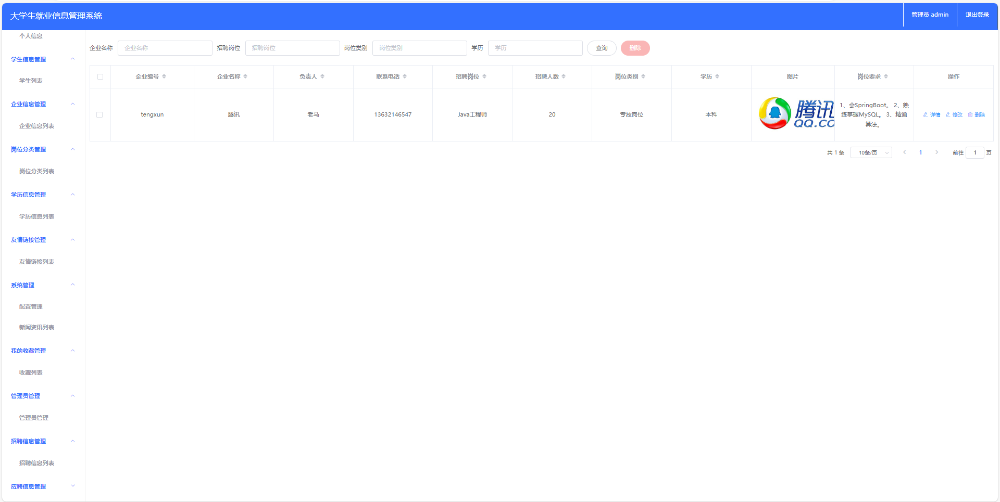
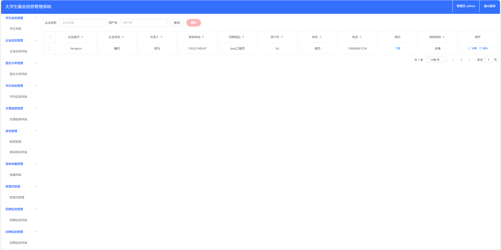

# 大学生就业信息管理系统

### 完整项目获取

通过网盘分享的文件：求职招聘系统

链接: https://pan.baidu.com/s/1vhA5X0teCArtYawcZk8zoQ?pwd=mgbi 提取码: mgbi
--来自百度网盘超级会员v3的分享

### 项目合集(项目不断更新中，包含java、vue、python、Android、微信小程序等项目)

链接: https://pan.baidu.com/s/1nY-zhvAK0CXYcn3g7LzQnQ?pwd=id3c 提取码: id3c
--来自百度网盘超级会员v3的分享

### 工具包

链接: https://pan.baidu.com/s/1YmdoJvkjoUjA75wvHLDZ6A?pwd=xm96 提取码: xm96
--来自百度网盘超级会员v3的分享

需要远程项目部署或项目修改和毕业设计也可联系（添加申请时请备注好来意）

### 远程调试部署联系方式

链接: https://pan.baidu.com/s/1W0dDcoZmayG0c7USJDYBYg?pwd=nqd7 提取码: nqd7
--来自百度网盘超级会员v3的分享

#### 这些项目一起发你了 可以分享给你需要的同学 调试可找我 也接二次修改和项目定制、毕业设计等

## 接毕业设计和论文

微信联系方式：xzxj0206  QQ：3808981644   (支持修改、 部署调试、 支持代做毕设)

接网站建设、小程序、H5、APP、各种系统等，单片机、嵌入式也可以做

选题+开题报告+任务书+程序定制+安装调试+论文+答辩ppt  都可以做

## 一、项目介绍

开发语言：java

运行环境:idea或eclipse 数据库:mysql

三个角色：管理员、企业、求职者

前端技术：Vue.js、ElementUI、HTML、CSS、JS、Jquery

后端技术：SpringBoot、Mybatis

[1]管理员：登录、个人中心、学生信息管理、企业信息管理、岗位分类管理、学历信息管理、友情链接管理、新闻资讯管理、收藏管理、招聘信息管理、应聘信息管理、求职者信息管理

[2]企业：注册、登录、个人信息管理、招聘信息管理、应聘信息管理

[3]学生：注册、登录、招聘信息、求职者信息、投递简历、友情链接、留言板、个人中心、后台管理、新闻资讯

## 二、部分功能界面展示

